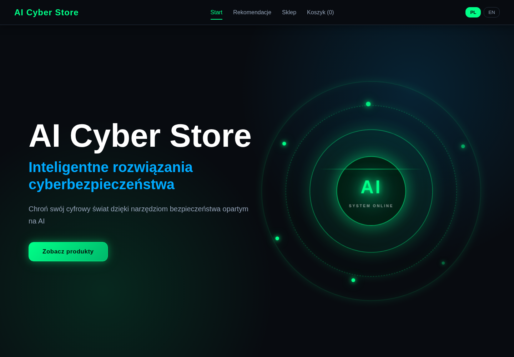
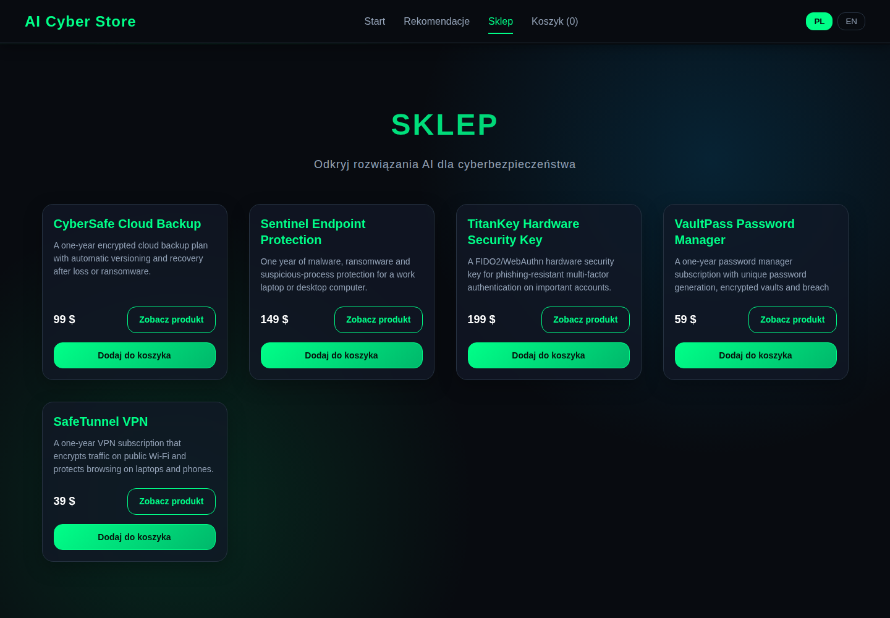
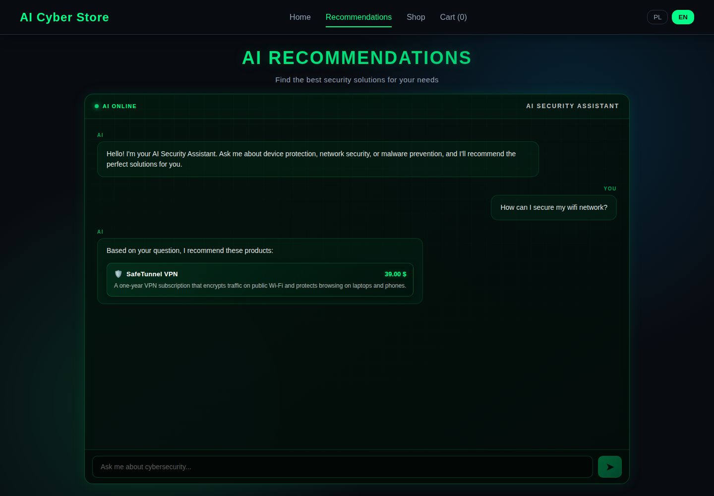
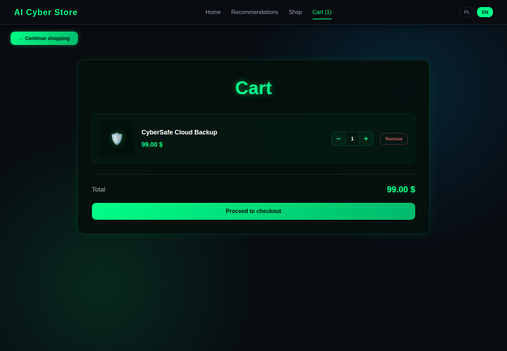

# AI Cyber Store

Responsive cybersecurity storefront built as a full-stack portfolio project. A React interface presents a live WooCommerce catalogue, cart flow and bilingual security assistant. The FastAPI service classifies PL/EN questions, ranks matching products and returns products from the same WooCommerce catalogue used by the shop.

The recommendation pipeline runs locally without an API key. It combines a scikit-learn intent classifier, confidence thresholding and deterministic fuzzy matching. An optional OpenAI-compatible LLM endpoint can be configured as a final text fallback, but it is not required for the demonstrated flow.

## Screenshots

### Storefront



### WooCommerce catalogue



### Recommendation result



### Mobile view


### Store API cart



## Implemented features

- Responsive React + TypeScript storefront at desktop, tablet and mobile widths
- Polish and English interface with `react-i18next`
- Five-product WooCommerce demo catalogue with an idempotent PHP seed
- Product list, product details and Store API cart operations
- Conversational recommendation UI with in-chat product results
- PL/EN intent classification, confidence threshold and fuzzy fallback
- Live product hydration from the public WooCommerce Store API
- Static recommendation catalogue fallback when WordPress is unavailable
- Optional OpenAI-compatible LLM fallback configured through environment variables
- FastAPI health, intent and recommendation endpoints
- Docker Compose health checks and persistent data volumes
- Frontend type checking, linting and production build
- Pytest suite with coverage for the recommendation service

## Architecture

```text
Browser
  │
  ├── React + TypeScript + Vite (:5173)
  │     ├── storefront / product / cart UI
  │     ├── WooCommerce Store API requests ──────────────┐
  │     └── /api/recommendation (Vite proxy)             │
  │                                                      │
  ├── FastAPI recommendation service (:8000)             │
  │     ├── scikit-learn intent classifier               │
  │     ├── RapidFuzz product matching                   │
  │     ├── optional OpenAI-compatible LLM fallback      │
  │     └── live product fetch ──────────────────────────┤
  │                                                      ▼
  └────────────────────────────────────── WordPress + WooCommerce (:8080)
                                                   │
                                                   ▼
                                                 MySQL
```

PostgreSQL is provisioned by Compose for backend expansion, but the current recommendation path is stateless and does not persist data there. MySQL is the active WordPress/WooCommerce database.

## Stack

| Area | Technology |
| --- | --- |
| Frontend | React 19, TypeScript, Vite, React Router, SCSS, react-i18next |
| Recommendation API | Python 3.12, FastAPI, Pydantic, scikit-learn, RapidFuzz, HTTPX |
| Commerce | WordPress, WooCommerce Store API, PHP |
| Data | MySQL for WordPress/WooCommerce; PostgreSQL container reserved for backend growth |
| Infrastructure | Docker, Docker Compose |
| Quality | TypeScript, Oxlint, Pytest, pytest-cov |

## Run locally

Requirements:

- Docker with Docker Compose
- Git

Clone and start the stack:

```bash
git clone https://github.com/marpot/ai-cyber-store.git
cd ai-cyber-store
docker compose up -d --build
```

On the first run, MySQL imports `wordpress_backup.sql`. WooCommerce 11.1.1 is included in the WordPress image. Activate it and seed or refresh the five demo products:

```bash
docker compose exec -T wordpress php -r \
  'require "/var/www/html/wp-load.php"; require_once ABSPATH . "wp-admin/includes/plugin.php"; activate_plugin("woocommerce/woocommerce.php");'

docker compose exec -T wordpress php -r \
  'require "/var/www/html/wp-load.php"; require "/scripts/seed-products.php";'
```

The product seed is idempotent: it updates products by slug instead of duplicating them.

Open these URLs using `localhost` (the development CORS allowlist is configured for that origin):

- Frontend: http://localhost:5173
- WordPress/WooCommerce: http://localhost:8080
- FastAPI health: http://localhost:8000/health
- FastAPI docs: http://localhost:8000/docs

Inspect or stop the stack without deleting its named volumes:

```bash
docker compose ps
docker compose logs -f
docker compose down
```

## Recommendation API

The frontend calls `POST /api/recommendation` through the Vite proxy. A direct request looks like this:

```bash
curl -X POST http://localhost:8000/api/recommendation \
  -H 'Content-Type: application/json' \
  -d '{"message":"How can I secure my wifi network?","language":"en"}'
```

The response includes the detected intent, confidence, language, fallback path and matching WooCommerce products. Other useful endpoints are:

- `GET /health`
- `GET /intents`
- `POST /recommendation` — legacy intent-only endpoint

## Environment configuration

Examples are included in `.env.example`, `frontend/.env.example` and `recommendation-service/.env.example`. The Compose defaults are enough for the local deterministic flow.

Optional recommendation settings include:

- `RECOMMENDATION_CONFIDENCE_THRESHOLD`
- `PRODUCT_CACHE_TTL`
- `LLM_API_KEY`
- `LLM_BASE_URL`
- `LLM_MODEL`
- `CORS_ALLOW_ORIGINS`

Do not commit real credentials or local `.env` files.

## Checks

Frontend:

```bash
cd frontend
npm run typecheck
npm run lint
npm run build
```

Recommendation service:

```bash
docker compose exec -T recommendation-service python -m pytest
docker compose exec -T recommendation-service \
  python -m pytest --cov=app --cov-report=term-missing
```

The Makefile also exposes common Compose, frontend and test commands. At the time of this portfolio pass, the recommendation suite contains 60 passing tests and reports 90% total coverage.

## Project structure

```text
frontend/                 React storefront and recommendation UI
recommendation-service/   FastAPI app, classifier, fuzzy matcher and tests
wordpress/                WordPress configuration, WooCommerce image and seed
docs/screenshots/         Screenshots captured from the running application
docker-compose.yml        Local orchestration and health checks
Makefile                  Common development commands
```

## Status

This repository is a functional portfolio prototype, not a production commerce deployment. Checkout completion, authentication, payment processing and production secrets management are intentionally outside its current scope.

## Author

Marcin Potoczny — [GitHub](https://github.com/marpot)
